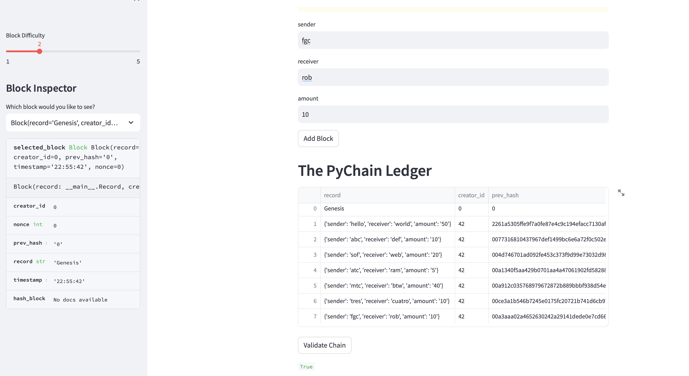
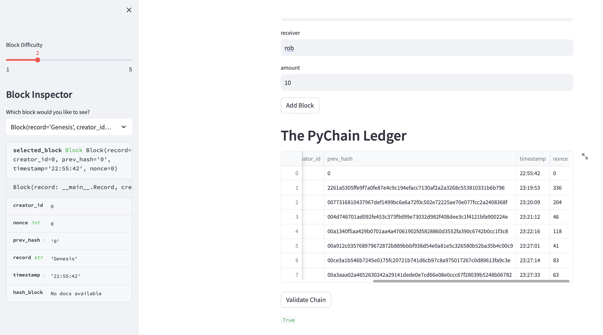

# PyChain Ledger
### Objective:
Build a blockchain-based ledger system with a user-friendly web interface. The ledger should verify the integrity of the data in the ledger and allow conducting transcations.

This is done by updating the provided Python file done in previous excercises of the blockchain module. The tasks for this excercise are:
1) Creating a new data class named Record to record the transactions that the blocks of the ledger will store.
2) Modifying the existing Block data class to store Record data.
3) Add Relevant User Inputs to the Streamlit interface.
4) Test the PyChain Ledger by Storing Records.

### Results
 
 
